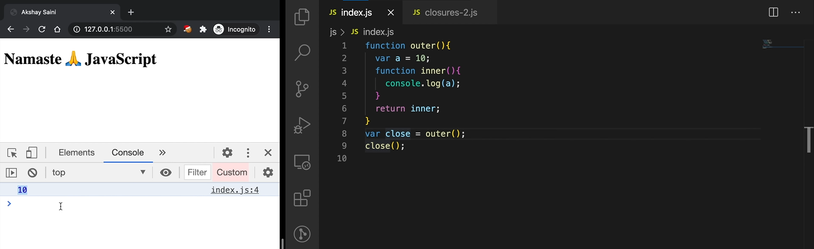
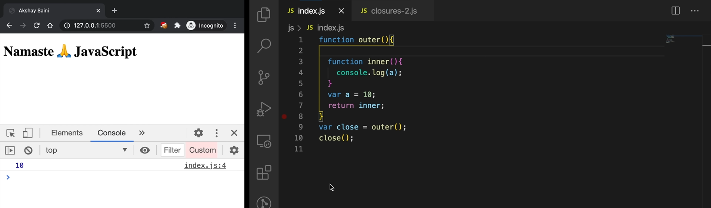
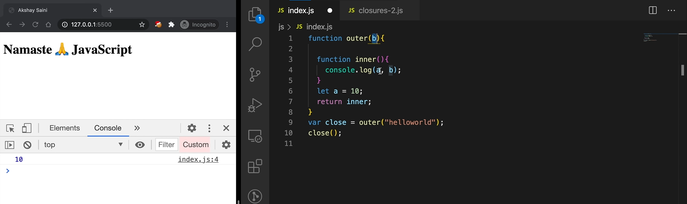
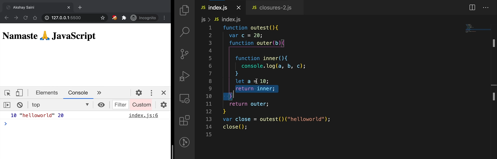
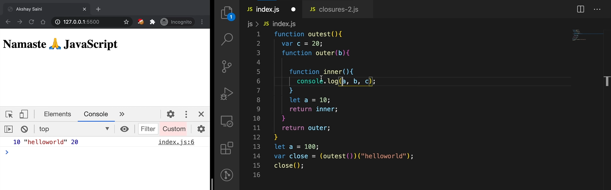
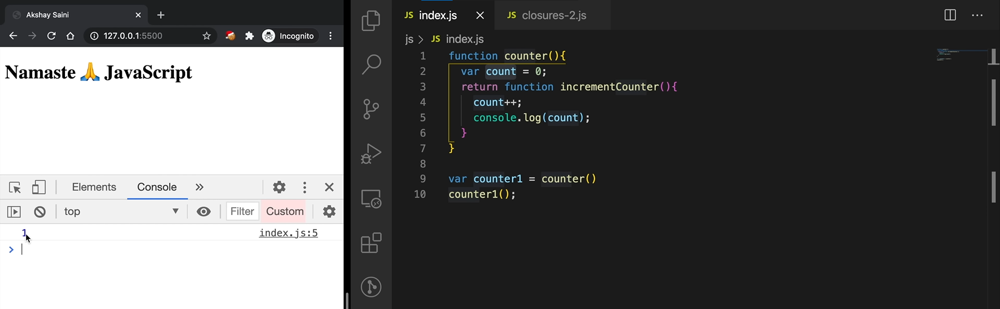
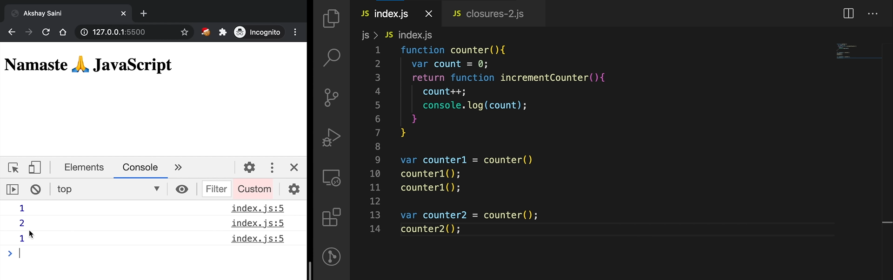
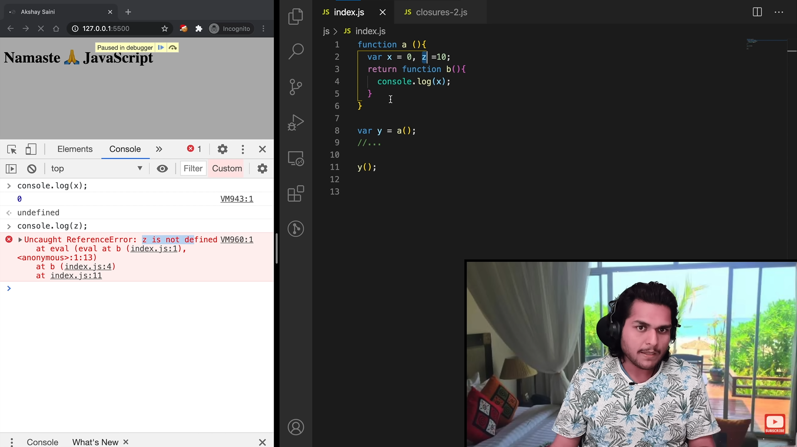

-------------------------- //! What is Closures --------------------------
A closure is the combination of a function bundled together (enclosed) with references to its surrounding state (the lexical environment). In other words, a closure gives a function access to its outer scope. In JavaScript, closures are created every time a function is created, at function creation time.

 garbage collection